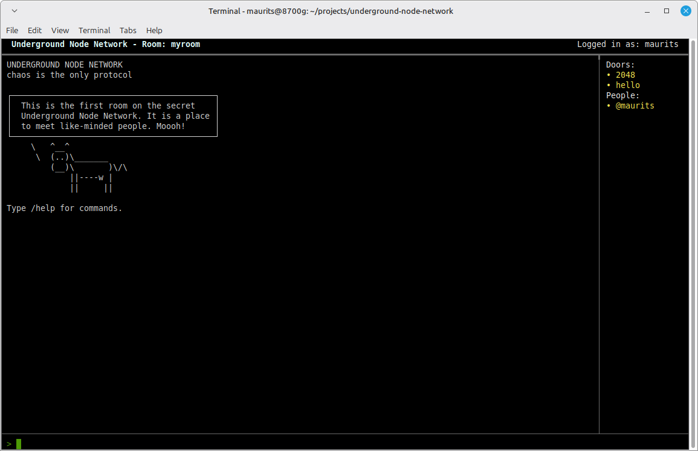

### The Underground Node Network (UNN)


The Underground Node Network (UNN) is a distributed, SSH‑based digital underworld disguised as a retro‑styled BBS. It runs entirely over standard SSH, requiring no custom client, no special terminal, and no additional software to participate at the basic level. Anyone with ssh or PuTTY can jack in.

At its core, UNN is not a traditional BBS. Instead, it is a living mesh of user‑operated nodes, each one a personal “room” that comes online the moment a user connects. These rooms are not static message boards—they are computational spaces, capable of hosting interactive services, puzzles, bots, simulations, or tools. Each service behaves like a classic BBS “door,” but with a modern twist: services are executed locally by the user who hosts them, written in any programming language they choose.


The network is discovered through public entry points—server addresses that act as rendezvous and signaling hubs. Entry points do not have rooms of their own and never proxy traffic; they only help peers find each other and coordinate NAT traversal. Once a direct P2P connection is established via hole-punching or reverse tunnels, visitors connect directly to user nodes over SSH, and the entry point is out of the picture. Visitors can explore the topology, discover active nodes, and interact with the services those nodes expose.

Each user’s node is ephemeral, appearing only while they are connected. When active, it becomes a computing micro‑hub inside the underground network. Other visitors can enter that node, use its services, and interact with whatever the node owner has chosen to host—tools, games, experiments, data forges, or strange artifacts of code.



UNN is designed to feel like a clandestine hacker‑den ecosystem:
a shifting constellation of personal machines, each offering unique capabilities, all connected through a shared SSH‑based fabric. It is a programmable world, a social computing experiment, and a collaborative underground network—built entirely from text, terminals, and imagination.


## Connecting

The easiest way to explore the network is using the `unn-client.sh` tool:

### Teleport to a Room
```bash
./unn-client.sh unn://localhost/roomname
```
*Note: The port defaults to **44322** if not specified. You can specify a download directory with `-downloads /path/to/dir` (defaults to `~/Downloads`).*

### Interactive Exploration
If you don't specify a room, you'll enter the entry point's interactive TUI:
```bash
./unn-client.sh unn://localhost
```
From here you can:
- List active rooms with `/rooms`
- Search and download files with `/files` and `/get`
- Exit with `/quit` or `/exit`
### Manual Exploration
If you're not using the client, you can connect directly using any SSH client. The entry point and room nodes provide **precalculated host fingerprints** (standard SHA256 base64 format) and **file verification signatures** (hex-encoded SHA256) for easy manual verification.

### Persistent Navigation
The client is persistent—when you exit a room (via `/quit [message]`, `/exit` or **Ctrl+C**), you are automatically returned to the entry point. The system uses **invisible ANSI OSC 31337 signaling** to coordinate teleports and file transfers, ensuring a clean visual experience. It also supports **window resizing**, **Ctrl+C interruption** for doors, and an **integrated Zmodem‑like block‑based file transfer protocol** that works over the existing SSH channel with **SHA256 integrity verification** and **server‑side rate limiting**.

## Hosting a Node

To become a part of the network and host your own "room":

1. **Register**: Connect to an entry point and register your SSH public key. Registration is **strictly enforced**—it ensures your username cannot be spoofed and is required for room hosting. UNN usernames must be **alphanumeric** and between 4 and 20 characters.
2. **Launch Room**: Run the UNN room node. It will automatically connect and register your node:
   ```bash
   ./start-room.sh
   ```
   *Note: If the room node cannot connect to the entry point, it will exit immediately with a fatal error.*
3. **Open Doors**: Your node will appear on the network. Visitors teleporting to you will undergo **P2P Visitor Authentication**, where the entry point verifies their key and pre-authorizes them with your node.

## Documentation

### [Application Architectures](docs/apps/README.md)
- [Entrypoint](docs/apps/entrypoint.md) - Signaling hub and discovery back-bone.
- [Room Node](docs/apps/room.md) - Ephemeral SSH server for hosting rooms and doors.
- [UNN Client](docs/apps/client.md) - Automated teleportation and navigation tool.

### [Software Architecture](docs/architecture/README.md)
- [File Structure](docs/architecture/file-structure.md) - High-level directory tree and component map.
- [Entrypoint Internals](docs/architecture/entrypoint.md) - Component-level view of the hub.
- [Room Node Internals](docs/architecture/room.md) - Building blocks of the node server.
- [Client Internals](docs/architecture/client.md) - Under the hood of the navigation tool.
- [UI Components](docs/architecture/ui-components.md) - Modular TUI architecture, logs, and forms.

### [Network Concepts](docs/concepts/README.md)
- [Identity & Verification](docs/concepts/identity.md) - Decentralized trust and key registration.
- [P2P & NAT Traversal](docs/concepts/p2p-nat.md) - Hole-punching and direct TCP streams.
- [Signaling Protocol](docs/concepts/signaling.md) - Custom control subsystems and ANSI OSC 31337.
- [TUI & Interactions](docs/concepts/tui_and_doors.md) - BBS experience, Input Bridges, and Doors.
- [Technical Details](docs/concepts/implementation_details.md) - Deep dive into internal mechanics.

