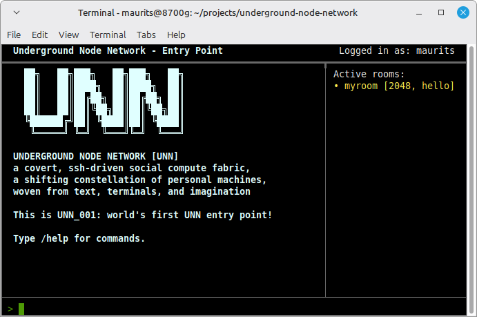
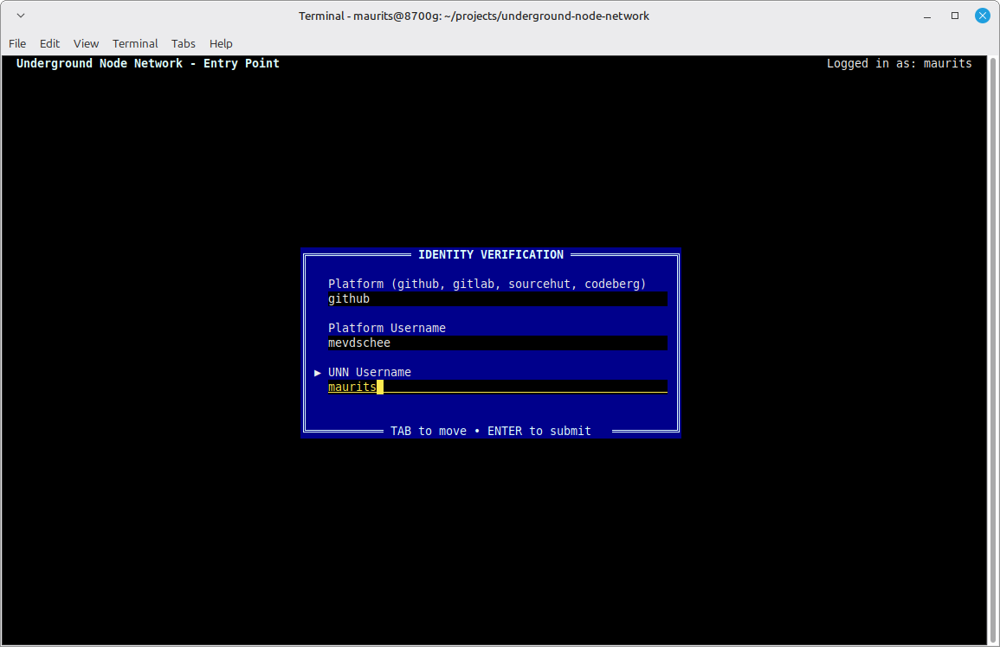
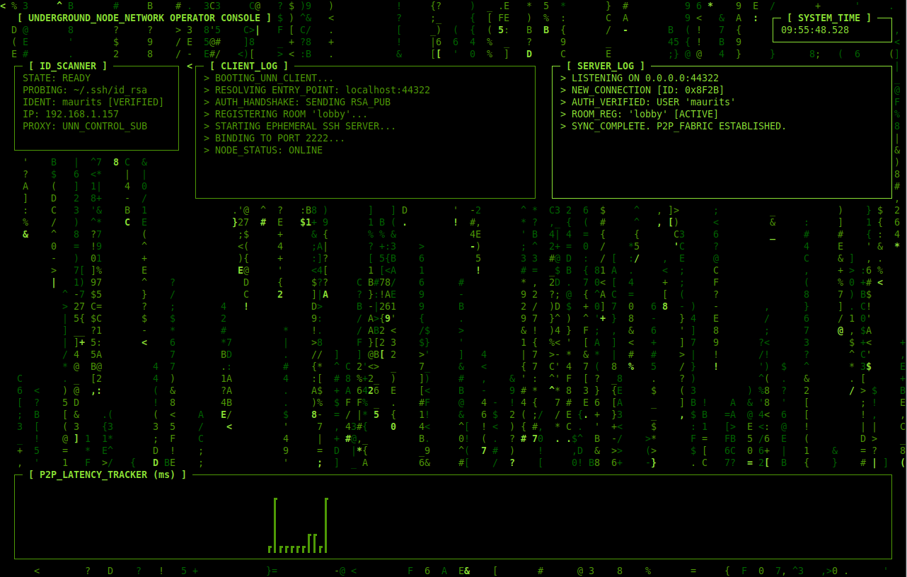

### The Underground Node Network (UNN)



The Underground Node Network (UNN) is a distributed, SSH‑based digital underworld disguised as a retro‑styled BBS. It runs entirely over standard SSH, requiring no custom client, no special terminal, and no additional software to participate at the basic level. Anyone with ssh or PuTTY can jack in.

At its core, UNN is not a traditional BBS. Instead, it is a living mesh of user‑operated nodes, each one a personal “room” that comes online the moment a user connects. These rooms are not static message boards—they are computational spaces, capable of hosting interactive services, puzzles, bots, simulations, or tools. Each service behaves like a classic BBS “door,” but with a modern twist: services are executed locally by the user who hosts them, written in any programming language they choose.



The network is discovered through public entry points—server addresses that act as rendezvous and signaling hubs. Entry points do not have rooms of their own and never proxy traffic; they only help peers find each other and coordinate NAT traversal. Once a direct P2P connection is established via hole-punching or reverse tunnels, visitors connect directly to user nodes over SSH, and the entry point is out of the picture. Visitors can explore the topology, discover active nodes, and interact with the services those nodes expose.

Each user’s node is ephemeral, appearing only while they are connected. When active, it becomes a computing micro‑hub inside the underground network. Other visitors can enter that node, use its services, and interact with whatever the node owner has chosen to host—tools, games, experiments, data forges, or strange artifacts of code.

UNN is designed to feel like a clandestine hacker‑den ecosystem:
a shifting constellation of personal machines, each offering unique capabilities, all connected through a shared SSH‑based fabric. It is a programmable world, a social computing experiment, and a collaborative underground network—built entirely from text, terminals, and imagination.



## Connecting

The easiest way to explore the network is using the `unn-ssh.sh` wrapper script:

### Teleport to a Room
```bash
./unn-ssh.sh ssh://localhost:44322/roomname
```

### Interactive Exploration
If you don't specify a room, you'll enter the entry point's interactive shell:
```bash
./unn-ssh.sh ssh://localhost:44322
```
From here you can:
- List active rooms with `/rooms`
- Search and download files with `/files` and `/get`
### Manual Exploration
If you're not using the wrapper, you can connect directly using any SSH client. The entry point and room nodes provide **precalculated host fingerprints** (standard SHA256 base64 format) and **file verification signatures** (hex-encoded SHA256) for easy manual verification.

### Persistent Navigation
The wrapper is persistent—when you exit a room (via **Ctrl+C**), you are automatically returned to the entry point shell. It also supports **window resizing**, **Ctrl+C interruption** for doors, and **automated file downloads** via a secure, one-shot SFTP server with **mutual authentication** and **filename obfuscation**.

## Hosting a Node

To become a part of the network and host your own "room":

1. **Register**: Connect to an entry point and register your SSH public key. Registration is **strictly enforced**—it ensures your username cannot be spoofed and is required for room hosting.
2. **Launch Client**: Run the UNN client. It will automatically connect and register your node:
   ```bash
   ./start-client.sh
   ```
   *Note: If the client cannot connect to the entry point, it will exit immediately with a fatal error.*
3. **Open Doors**: Your node will appear on the network. Visitors teleporting to you will undergo **P2P Visitor Authentication**, where the entry point verifies their key and pre-authorizes them with your node.

## Documentation

- [SSH Wrapper](docs/SSH_WRAPPER.md) - Details on the `unn-ssh` tool.
- [Download Tool](docs/DOWNLOAD_TOOL.md) - Features and architecture of `unn-dl`.
- [Client Architecture](docs/CLIENT.md) - How room nodes work.
- [Server Architecture](docs/SERVER.md) - How entry points function.
- [Implementation Details](docs/IMPLEMENTATION.md) - Protocols and flow.
- [P2P & NAT Traversal](docs/P2P.md) - How direct connections are established.

