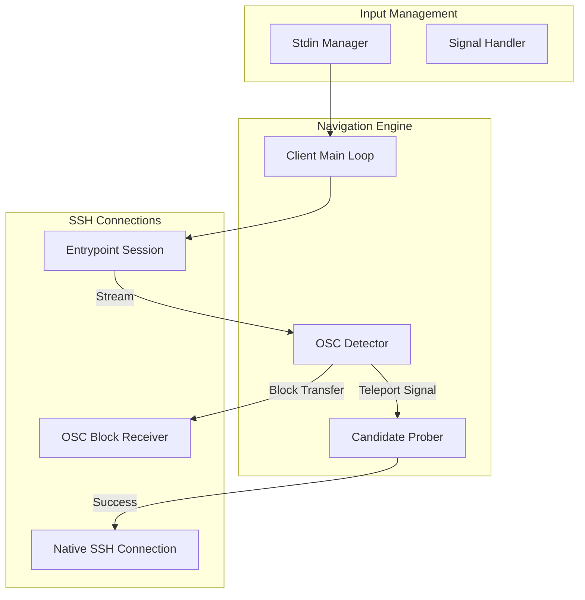

# UNN Client Architecture

The **UNN Client** (`unn-client`) is an automation layer that manages the transition between network hops. It ensures the user experiences a seamless "teleport" between the entrypoint and room nodes.

### Component Overview

### Key Modules

- **Stdin Manager**: A thread-safe input proxy that allows the client to pause/resume user input during transitions (e.g., between the entrypoint and a room). This prevents "ghost" characters from leaking into the terminal during handshakes.
- **OSC Detector**: A real-time stream analyzer that looks for ANSI OSC 31337 sequences (`\x1b]31337;...`) in the entrypoint's output. These sequences carry P2P candidates and connection metadata.
- **P2P Connector**: Coordinates with the entrypoint to perform **two-way UDP hole-punching**, then establishes a QUIC connection to the room using the `p2pquic` library.
- **SSH over QUIC**: Wraps the QUIC stream in a `net.Conn` interface (`QUICStreamConn`) and establishes an SSH session over it for the interactive terminal.

### Persistence Logic
The client implements a `for { ... }` reconnect loop. When a room connection exits (via Ctrl+C or disconnect), the client clears the terminal and immediately restores the active Entrypoint session, giving the user the feel of a persistent "Operating System" for the network.

URL parsing is handled strictly via the `unn://` scheme, defaulting to port **44322** for the entrypoint. The room name is an optional path component.

---
See also: [Client Role](../apps/client.md) | [Signaling Protocol](../concepts/signaling.md)
