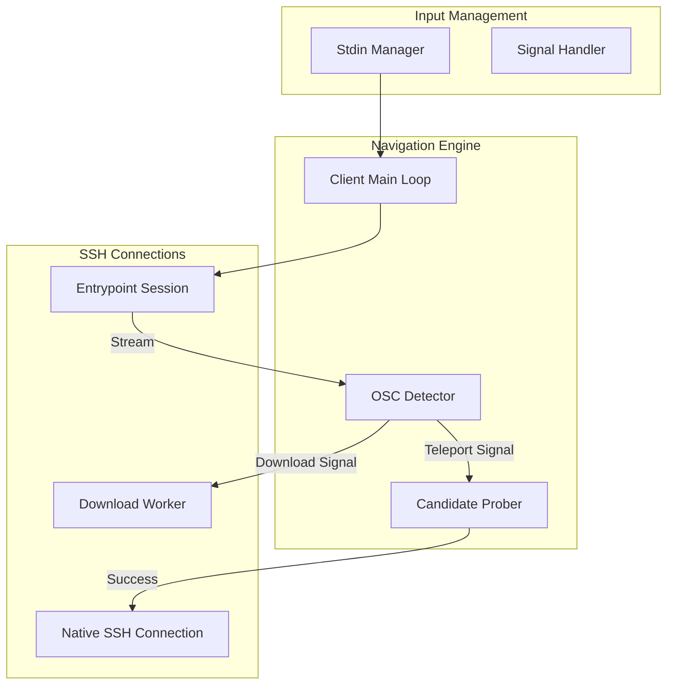

# UNN Client Architecture

The **UNN Client** (`unn-client`) is an automation layer that manages the transition between network hops. It ensures the user experiences a seamless "teleport" between the entrypoint and room nodes.

### Component Overview

### Key Modules

- **Stdin Manager**: A thread-safe input proxy that allows the client to pause/resume user input during transitions (e.g., between the entrypoint and a room). This prevents "ghost" characters from leaking into the terminal during handshakes.
- **OSC Detector**: A real-time stream analyzer that looks for ANSI OSC 9 sequences (`\x1b]9;...`) in the entrypoint's output. These sequences carry the P2P candidates and download metadata.
- **Candidate Prober**: Executes parallel TCP dials to all advertised room candidates (LAN, Public, Tunnel) to find the fastest reachable path before handing off to the native SSH client.
- **Native SSH Bridge**: For the final room connection, the client executes the system `ssh` binary (or falls back to an internal client) with pre-configured host key verification extracted from the signaling layer.

### Persistence Logic
The client implements a `for { ... }` reconnect loop. When a room connection exits (via Ctrl+C or disconnect), the client clears the terminal and immediately restores the active Entrypoint session, giving the user the feel of a persistent "Operating System" for the network.

---
See also: [Client Role](../apps/client.md) | [Signaling Protocol](../concepts/signaling.md)
