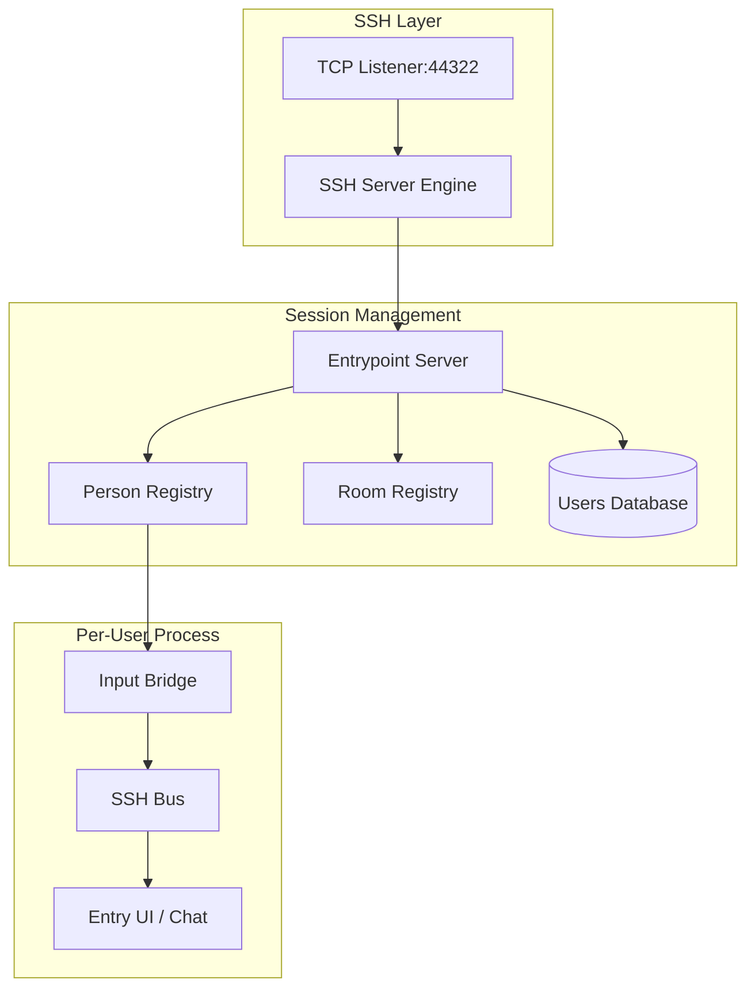

# UNN Entrypoint Architecture

The **UNN Entrypoint** acts as the central signaling hub and user directory. It is designed to handle many simultaneous terminal sessions while coordinating off-band P2P signaling.

### Component Overview

### Key Modules

- **Server Engine (`internal/entrypoint`)**: Manages the lifecycle of both "Persons" (visitors) and "Operators" (room nodes). It handles the control subsystem for room registration.
- **Input Bridge**: Decouples the raw SSH network read from the TUI event loop. It allows for asynchronous signaling (like teleportation) without blocking the terminal input.
- **Entry UI (`internal/ui`)**: A `tcell`-based TUI that provides the "BBS" experience, including the registration form and the global chat lobby.
- **Registration Database**: A simple, file-backed atomic store that maps SSH public keys to UNN identities and external platform verification status.

### Data Flow: Role-based Handling
1. **Operators**: Connect via a specialized `unn-control` subsystem. They send periodic heartbeat-like registrations with their P2P candidates and active doors.
2. **Persons**: Enter the interactive TUI. They interact with the interface to browse rooms and initiate P2P "teleports."

---
See also: [Entrypoint Role](../apps/entrypoint.md) | [Signaling Pattern](../concepts/signaling.md)
