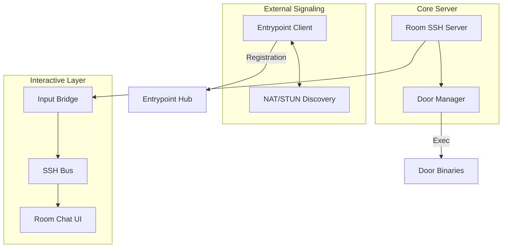

# UNN Room Node Architecture

The **UNN Room Node** is a hybrid SSH server that provides a BBS-like interactive environment while dynamically hosting external "Door" applications and secure file servers.

### Component Overview

### Key Modules

- **SSH Server (`internal/sshserver`)**: A customized `crypto/ssh` server that implements the UNN authentication model (handover-trust). It manages the multiplexing between the chat console and active doors, and handles **OSC-based inbound file transfers**.
- **Door Manager (`internal/doors`)**: Responsible for scanning a local directory for executables and managing their lifecycle (execution, TTY allocation, and cleanup).
- **NAT/QUIC (`internal/nat`)**: Provides `QUICStreamConn` (wraps QUIC streams as `net.Conn` for SSH) and `SSHSignalingClient` for p2pquic peer registration. Server-reflexive addresses are provided by the entrypoint from the TCP connection.

### Process Isolation
When a visitor executes a Door:
1. The Chat TUI is suspended.
2. The `Input Bridge` is redirected to the door's `stdin`.
3. The door binary is executed in a new PTY.
4. Upon exit, the `SSH Bus` triggers a reset and restores the Chat TUI.

---
See also: [Room Node Role](../apps/room.md) | [TUI & Doors](../concepts/tui_and_doors.md)
